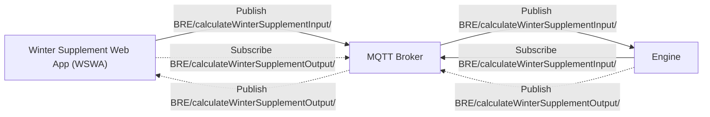

# A Rules Engine with MQTT Broker and Winter Supplement Web App

## Software Language

This project is written in Python.

## Prerequisites

This project is running inside Docker. Please install Docker and Docker Compose in your environment. 

## System Structure

This system consists of the Winter Supplement Web App (WSWA), an MQTT broker and the rules engine. The system is shown as follows.


```mermaid
graph LR
  A["Winter Supplement Web App (WSWA)"] -->|Publish BRE/calculateWinterSupplementInput/| B[MQTT Broker]
  B --> |Publish BRE/calculateWinterSupplementInput/| C[Engine]
  C --> |Subscribe BRE/calculateWinterSupplementInput/| B
  C -.-> |Publish BRE/calculateWinterSupplementOutput/| B
  B -.-> |Publish BRE/calculateWinterSupplementOutput/| A
  A -.-> |Subscribe BRE/calculateWinterSupplementOutput/| B
```

In the WSWA, users input their data, and click submit button. WSWA works as a MQTT client and publishes this message of user input to the MQTT broker. The topic of this MQTT message is `BRE/calculateWinterSupplementInput/`. My engine also works as a MQTT client and subscribe to this topic to receive this message. My engine then will process the data based on the rules of winter supplement. My engine publishes the calculated data to the topic `Subscribe BRE/calculateWinterSupplementOutput/`. And the WSWA subscribes to this topic to get the message.

In order to develop the engine more conveniently, I made the mock version of the WSWA. It works as an MQTT client. Both my engine and the mock WSWA are running inside the Docker containers.

## How to run the Engine

### Download project

```cmd
git clone https://github.com/feliciavan/mqtt.git
```

### Build the Docker images
  
In the `mqtt` directory, modify the content in `.env`, which contains the environment variables about MQTT's topics. The content is:

```cmd
TopicInput=RE/calculateWinterSupplementInput/
TopicOutput=RE/calculateWinterSupplementOutput/
```

where it is different from the ones in the requirements. It is self-specified in order to receive the published messages more efficiently. I can set it to the assignment-specified ones, which are

```cmd
TopicInput=BRE/calculateWinterSupplementInput/
TopicOutput=BRE/calculateWinterSupplementOutput/
```

Under this circumstance, I do not need to run the container of the mock WSWA. I can directly use the provided one.

Build the Docker images

```cmd
docker compose build
```

Check the Docker images

```cmd
docker image ls
```

The output will be:

```cmd
REPOSITORY    TAG       IMAGE ID       CREATED          SIZE
mqtt-engine   latest    8a90b9a1f58e   39 seconds ago   133MB
mqtt-webapp   latest    3628a8b8c797   39 seconds ago   133MB
```

where `mqtt-webapp` is a mock version of the WSWA. `mqtt-engine` is the engine I developed.

### Start the containers

Start the container of the engine:

```cmd
docker compose up engine -d
```

If I use the self-specified MQTT topics, I can start the container of the webapp:

```cmd
docker compose up webapp -d
```

Check the Docker containers

```cmd
docker ps
```

The output will be

```cmd
CONTAINER ID   IMAGE          COMMAND              CREATED       STATUS       PORTS     NAMES
710914754e64   8b5fd51228c7   "python webApp.py"   2 hours ago   Up 2 hours             webApp
340d0e0640f2   799997715edf   "python engine.py"   2 hours ago   Up 2 hours             engine
```

where `webApp` is the mock version of the WSWA and `engine` is the rules engine I developed.

### Check Docker logs

Check the logs of the engine:

```cmd
docker logs engine
```

If I run the container of the webapp, I can also check the logs of the webapp container:

```cmd
docker logs webapp
```

The logs are located outside the Docker containers as well. The location is mqtt/log, where `engine.log` is the log of the engine container, and `webapp.log` is the log of the webapp container.