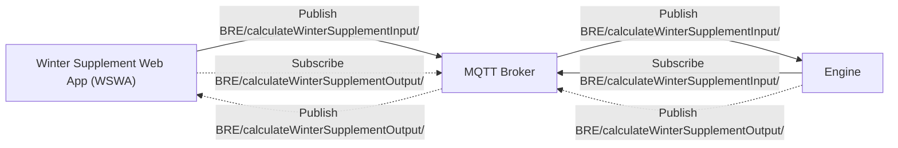

# A Rules Engine with MQTT Broker and Winter Supplement Web App

- [A Rules Engine with MQTT Broker and Winter Supplement Web App](#a-rules-engine-with-mqtt-broker-and-winter-supplement-web-app)
  - [Software Language](#software-language)
  - [Prerequisites](#prerequisites)
  - [System Structure](#system-structure)
  - [How to run the Engine](#how-to-run-the-engine)
    - [Download project](#download-project)
    - [Build the Docker images](#build-the-docker-images)
    - [Start the containers](#start-the-containers)
      - [Self-specified](#self-specified)
        - [Check Docker logs](#check-docker-logs)
      - [Assignment-specified](#assignment-specified)
        - [Check Docker logs](#check-docker-logs-1)
  - [Unit Test](#unit-test)
    - [Unit Test for `onConnect`](#unit-test-for-onconnect)
    - [Unit Test for `onMessage`](#unit-test-for-onmessage)


## Software Language

This project is written in Python.

## Prerequisites

This project runs inside Docker. Please install Docker and Docker Compose in your environment. 

## System Structure

The system structure is shown as follows.


```mermaid
graph LR
  A["Winter Supplement Web App (WSWA)"] -->|Publish BRE/calculateWinterSupplementInput/| B[MQTT Broker]
  B --> |Publish BRE/calculateWinterSupplementInput/| C[Engine]
  C --> |Subscribe BRE/calculateWinterSupplementInput/| B
  C -.-> |Publish BRE/calculateWinterSupplementOutput/| B
  B -.-> |Publish BRE/calculateWinterSupplementOutput/| A
  A -.-> |Subscribe BRE/calculateWinterSupplementOutput/| B
```

This system consists of the Winter Supplement Web App (WSWA), an MQTT broker and the rules engine, where the engine is my main develop content. In the WSWA, users input their data, and click submit button. WSWA works as a MQTT client and publishes this message of user input to the MQTT broker. The topic of this MQTT message is `BRE/calculateWinterSupplementInput/`. The engine also works as a MQTT client and subscribes to this topic to receive this message. After receiving the message, the engine processes the data based on the rules of winter supplement. Then the engine publishes the calculated data to the topic `Subscribe BRE/calculateWinterSupplementOutput/`. And the WSWA subscribes to this topic to get the message.

> In order to develop the engine more conveniently, I made the mock version of the WSWA. The MQTT topics are different from the assignment-specified ones. Because the MQTT broker is the same to all developers, I don't want to mix my design with others. 

> In order to deploy and run the project more easily, both the engine and the mock WSWA run inside the Docker containers.

## How to run the Engine

### Download project

```cmd
git clone https://github.com/feliciavan/mqtt.git
```

  
In the `mqtt` directory, modify the content in `.env`, which contains the environment variables about MQTT topics. The content is:

```cmd
TopicInput=RE/calculateWinterSupplementInput/
TopicOutput=RE/calculateWinterSupplementOutput/
```

where it is self-specified in order to separate with the assignment-specified ones. I can set it to the assignment-specified ones, which are

```cmd
TopicInput=BRE/calculateWinterSupplementInput/
TopicOutput=BRE/calculateWinterSupplementOutput/
```

Under this circumstance, I do not need to run the container of the mock WSWA. I can directly use the existing one.

### Build the Docker images

```cmd
docker compose build
```

Check the Docker images

```cmd
docker image ls
```

The output is:

```cmd
REPOSITORY    TAG       IMAGE ID       CREATED         SIZE
mqtt-webapp   latest    301bc19e8d42   4 seconds ago   133MB
mqtt-engine   latest    88d10be74dba   4 seconds ago   133MB
```

where `mqtt-engine` is the engine I developed. `mqtt-webapp` is a mock version of the WSWA. This mock WSWA will publish 5 messages for 5 different cases, which are:

- Case 1: Not eligible
  - Topic: `RE/calculateWinterSupplementInput/topic-id-not-eligible`
  - Message:
    ```json
    {
      "id": "id-not-eligible",
      "numberOfChildren": 0,
      "familyComposition": "single",
      "familyUnitInPayForDecember": false
    }
    ```

- Case 2: Single with no children
  - Topic: `RE/calculateWinterSupplementInput/topic-id-single-no-children`
  - Message:
    ```json
    {
      "id": "id-single-no-children",
      "numberOfChildren": 0,
      "familyComposition": "single",
      "familyUnitInPayForDecember": true
    }
    ```

- Case 3: Couple with no children
  - Topic: `RE/calculateWinterSupplementInput/topic-id-couple-no-children`
  - Message:
    ```json
    {
      "id": "id-couple-no-children",
      "numberOfChildren": 0,
      "familyComposition": "couple",
      "familyUnitInPayForDecember": true
    }
    ```
  
- Case 4: Couple with children
  - Topic: `RE/calculateWinterSupplementInput/topic-id-couple-with-children`
  - Message:
    ```json
    {
      "id": "id-couple-with-children",
      "numberOfChildren": 2,
      "familyComposition": "couple",
      "familyUnitInPayForDecember": true
    }
    ```
  
- Case 5: Single with children
  - Topic: `RE/calculateWinterSupplementInput/topic-id-single-with-children`
  - Message:
    ```json
    {
      "id": "id-single-with-children",
      "numberOfChildren": 3,
      "familyComposition": "single",
      "familyUnitInPayForDecember": true
    }
    ```

Here, I set the topic ID to be the specific case name for evident clarity in the logs. I can also set the topic ID to be the randome UUID.

### Start the containers

#### Self-specified

Set the `.env` to self-specified MQTT topics:

```cmd
TopicInput=RE/calculateWinterSupplementInput/
TopicOutput=RE/calculateWinterSupplementOutput/
```

Start the containers of the engine and the webapp (WSWA):

```cmd
docker compose up -d
```

Check the Docker containers

```cmd
docker ps
```

The output will be

```cmd
CONTAINER ID   IMAGE         COMMAND              CREATED         STATUS         PORTS     NAMES
b084e7d16cfe   mqtt-engine   "python engine.py"   2 seconds ago   Up 2 seconds             engine
ee762992cd59   mqtt-webapp   "python webApp.py"   2 seconds ago   Up 2 seconds             webapp
```

where `webapp` is the mock version of the WSWA and `engine` is the rules engine I developed.

##### Check Docker logs

Check the logs of the engine container:

```cmd
docker logs engine
```

Check the logs of the webapp container:

```cmd
docker logs webapp
```

The logs are located outside the Docker containers as well. The location is mqtt/log, where `engine.log` is the log of the engine container, and `webapp.log` is the log of the webapp container.

#### Assignment-specified

If the previous containers are running, stop them:

```cmd
docker stop webapp engine
```

Set the `.env` to assginment-specified MQTT topics:

```cmd
TopicInput=BRE/calculateWinterSupplementInput/
TopicOutput=BRE/calculateWinterSupplementOutput/
```

At this time, the webapp container is no longer needed, since I am using the existing one, i.e., the online WSWA.

Only start the container of the engine:

```cmd
docker compose up engine -d
```

Check the Docker containers

```cmd
docker ps
```

The output will be

```cmd
CONTAINER ID   IMAGE         COMMAND              CREATED         STATUS         PORTS     NAMES
dbdf113b65d5   mqtt-engine   "python engine.py"   3 seconds ago   Up 2 seconds             engine
```

##### Check Docker logs

Check the logs of the engine:

```cmd
docker logs engine
```

## Unit Test

The code of the engine is in file `engine.py`. It contains 2 callback functions, which are `onConnect` and `onMessage`. The are related to `on_connect` and `on_message` of the MQTT client, respectively. I made 2 unit tests for these 2 functions.

Go inside the Docker container `engine`, to run the unit tests.

```cmd
docker exec -it engine bash
```

In the `/app` directory, `testEngineOnMessage.py` is the unit test for `onMessage`, and `testEngineOnConnect.py` is the unit test for `onConnect`.

### Unit Test for `onConnect`

To test `onConnect` function in `engine.py`, run

```cmd
python -m unittest -v testEngineOnConnect.py
```

I prepare 2 test cases. One is that reason code is 0, denoting success. The other is reason code is 1, denoting refuse.

The test results are:

```cmd
testSubscribeRefuse (testEngineOnConnect.TestOnConnect.testSubscribeRefuse) ... 2024-11-30 15:58:04.064 | INFO     | engine:onConnect:20 - Engine: Connected with result code 1
ok
testSubscribeSuccess (testEngineOnConnect.TestOnConnect.testSubscribeSuccess) ... 2024-11-30 15:58:04.066 | INFO     | engine:onConnect:20 - Engine: Connected with result code 0
ok

----------------------------------------------------------------------
Ran 2 tests in 0.005s

OK
```

### Unit Test for `onMessage`

To test `onMessage` function in `engine.py`, run

```cmd
python -m unittest -v testEngineOnMessage.py
```

I prepare 5 test cases, which are not eligible, single with no children, couple with no childre, couple with children and single with children.

The test results are:

```cmd
testCoupleHasChildren (testEngineOnMessage.TestOnMessage.testCoupleHasChildren) ... 2024-11-30 16:01:46.392 | INFO     | engine:onMessage:24 - Engine Received: RE/calculateWinterSupplementInput/123 b'{"id": "test4", "numberOfChildren": 2, "familyComposition": "couple", "familyUnitInPayForDecember": true}'
2024-11-30 16:01:46.393 | INFO     | engine:onMessage:55 - Engine Published to RE/calculateWinterSupplementOutput/123: {'id': 'test4', 'isEligible': True, 'childrenAmount': 2.0, 'baseAmount': 120.0, 'supplementAmount': 160.0}
ok
testCoupleNoChildren (testEngineOnMessage.TestOnMessage.testCoupleNoChildren) ... 2024-11-30 16:01:46.396 | INFO     | engine:onMessage:24 - Engine Received: RE/calculateWinterSupplementInput/123 b'{"id": "test3", "numberOfChildren": 0, "familyComposition": "couple", "familyUnitInPayForDecember": true}'
2024-11-30 16:01:46.397 | INFO     | engine:onMessage:55 - Engine Published to RE/calculateWinterSupplementOutput/123: {'id': 'test3', 'isEligible': True, 'childrenAmount': 0.0, 'baseAmount': 120.0, 'supplementAmount': 120.0}
ok
testNotEligible (testEngineOnMessage.TestOnMessage.testNotEligible) ... 2024-11-30 16:01:46.399 | INFO     | engine:onMessage:24 - Engine Received: RE/calculateWinterSupplementInput/123 b'{"id": "test1", "numberOfChildren": 0, "familyComposition": "single", "familyUnitInPayForDecember": false}'
2024-11-30 16:01:46.400 | INFO     | engine:onMessage:55 - Engine Published to RE/calculateWinterSupplementOutput/123: {'id': 'test1', 'isEligible': False, 'childrenAmount': 0.0, 'baseAmount': 0.0, 'supplementAmount': 0.0}
ok
testSingle (testEngineOnMessage.TestOnMessage.testSingle) ... 2024-11-30 16:01:46.402 | INFO     | engine:onMessage:24 - Engine Received: RE/calculateWinterSupplementInput/123 b'{"id": "test2", "numberOfChildren": 0, "familyComposition": "single", "familyUnitInPayForDecember": true}'
2024-11-30 16:01:46.403 | INFO     | engine:onMessage:55 - Engine Published to RE/calculateWinterSupplementOutput/123: {'id': 'test2', 'isEligible': True, 'childrenAmount': 0.0, 'baseAmount': 60.0, 'supplementAmount': 60.0}
ok

----------------------------------------------------------------------
Ran 4 tests in 0.013s

OK
```
